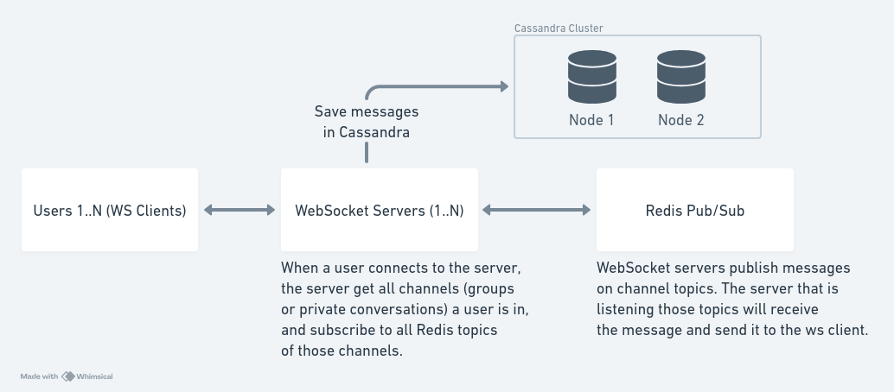

# Introduction

This is a simple test application that uses redis, cassandra and websocket servers to simulate a chat system with multiple websocket servers.

One important thing is that since it is not a good ideia to use the creation date to sort the messages, because there is a chance of two messages to be created on the exact same time, it is used UUID v7 as id of messages, because it is sortable. So the messages can be sorted by id.



# Pre requisites

- Docker
- Node.js 20 or higher

# How to execute

```bash
# Install project dependencies
npm ci

# Run docker containers on .docker folder
docker compose up -d

# When the cassandra docker container is created, it will automatically create some tables: "channels", "channel_users" and "messages"

# In one terminal tab, execute
WEB_SOCKET_PORT=3000 node src/server.js

# In another terminal tab, execute
WEB_SOCKET_PORT=3001 node src/server.js

# For a stress test, in another terminal tab, we are going to create our ws clients and send the messages from one user to another
node ws-clients.js
```
